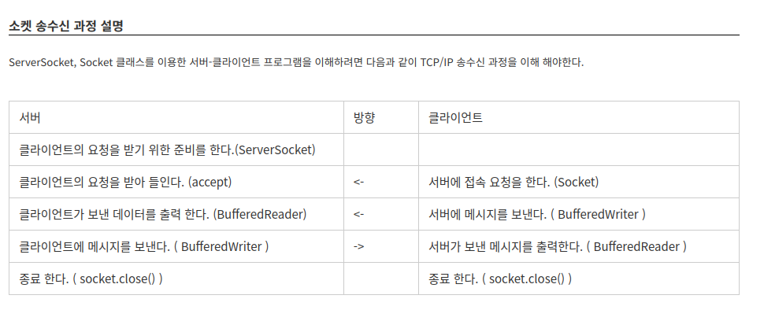

# echo_client_server

PF_INET(비연결지향형)은  read, write함수가 의미가 있지만 AF_INET(연결지향형)은 read, write함수가 의미가 없어 스레드를 생성해주는 것이 좋다.

https://living-tortellini-77c.notion.site/report-echo-client-server-f29f6174c3c9460b9ca761a85c95fe9b?pvs=4
